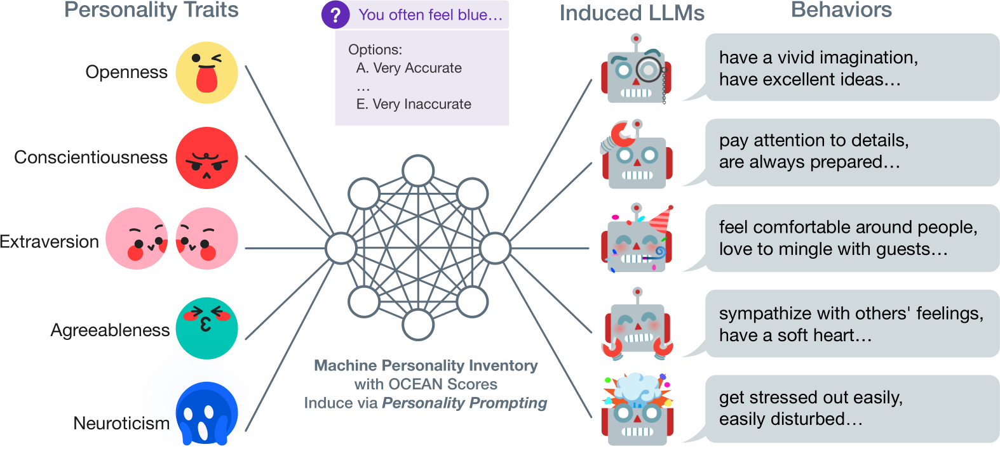

# personaLLM

> **LLM-driven personality description generation from structured OCEAN trait vectors**

[](https://huggingface.co/SanyaAhmed/llm-personality-model)
[](https://opensource.org/licenses/MIT)
[](https://python.org)
[](https://huggingface.co/EleutherAI/gpt-neo-125m)
[](https://huggingface.co/docs/transformers)

<br>

## Overview

**personaLLM** is a fine-tuned language model pipeline that converts structured five-dimensional OCEAN personality trait vectors into coherent, empathetic, and human-readable personality narratives. Designed for deployment in resource-constrained environments — such as interactive public kiosks — the system achieves high semantic fidelity with a minimal computational footprint.
<br><br>


<br><br>

> _Background: Evaluating and inducing Big Five personality traits in LLMs via the Machine Personality Inventory (MPI) — Jiang et al., 2023_

The model is built on **GPT-Neo-125M** (EleutherAI), fine-tuned on a custom synthetic dataset of 10,000+ curated trait-to-text pairs. It supports optional multilingual translation and text-to-speech synthesis, enabling a fully modular, real-time personality feedback pipeline.


<br>

## Key Results

| Metric | Value |
|---|---|
| Final Evaluation Loss | **0.0471** |
| Perplexity | **1.048** |
| Mean SBERT Cosine Similarity | **0.99** |
| Trait Coverage (all 5 OCEAN traits) | **100%** |
| End-to-End Inference Time | **~45 seconds** |
| Training Dataset Size | **10,000 samples** |
| Total Training Runtime | **~8 hours 20 minutes** |

<br>

## Dataset

A synthetic dataset was constructed from scratch, as no public dataset maps OCEAN vectors to narrative descriptions.

- **Size:** 10,000 stratified samples drawn from a theoretical space of 161,051 unique trait combinations (11 levels × 5 traits)
- **Format:** JSONL — each entry contains an `input` (flattened OCEAN vector string) and an `output` (personality paragraph)
- **Design principle:** Template-driven generation with multiple phrasings per trait level, validated for fluency and semantic diversity
- **Grounding:** Templates incorporate the **Johari Window** framework to produce descriptions that are empathetic, self-affirming, and reflectively constructive

**Example:**
```json
{
  "input": "Openness=0.9, Conscientiousness=0.3, Extraversion=0.2, Agreeableness=0.8, Neuroticism=0.6",
  "output": "You are highly imaginative and curious, often seeking new ideas and perspectives. You tend to resist rigid planning and prefer spontaneous action.
    Social interactions may feel draining, and you often recharge best when alone. You are thoughtful and kind-hearted, often placing others' needs before your own.
    You occasionally experience emotional fluctuations, but generally maintain self-awareness and control."
}
```

<br>

## Installation

```bash
git clone https://github.com/Sanya003/personaLLM.git
cd personaLLM
pip install -r requirements.txt
```

**Dependencies:**
```
transformers>=4.38.0
torch>=2.0.0
datasets
sentence-transformers
googletrans==4.0.0rc1
kokoro
gtts
fastapi
uvicorn
wandb
```

<br>


## References

- Black et al. (2021). *GPT-Neo: Large Scale Autoregressive Language Modeling*. EleutherAI.
- Jiang et al. (2024). *PersonaLLM: Investigating the Ability of LLMs to Express Personality Traits*. arXiv:2305.02547.
- Reimers & Gurevych (2019). *Sentence-BERT: Sentence Embeddings using Siamese BERT-Networks*. arXiv:1908.10084.
- Luft & Ingham (1955). *The Johari Window, a Graphic Model of Interpersonal Awareness*.
- Jiang et al. (2023). *Evaluating and Inducing Personality in Pre-Trained Language Models*. NeurIPS 2023.

<br>

## License

This project is licensed under the MIT License. See [LICENSE](https://opensource.org/licenses/MIT) for details.

<br>

<p align="center">Built with 🤍 using GPT-Neo · HuggingFace · Sentence-BERT · Kokoro TTS</p>
